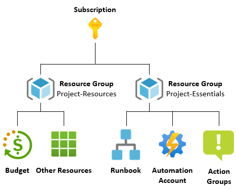
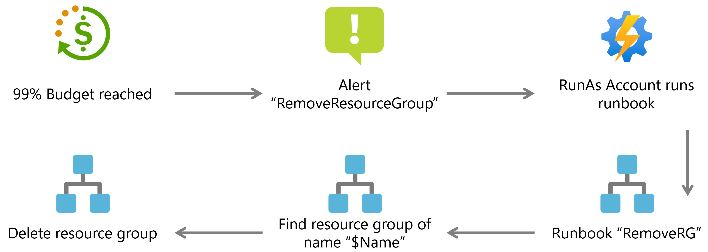
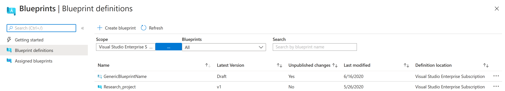
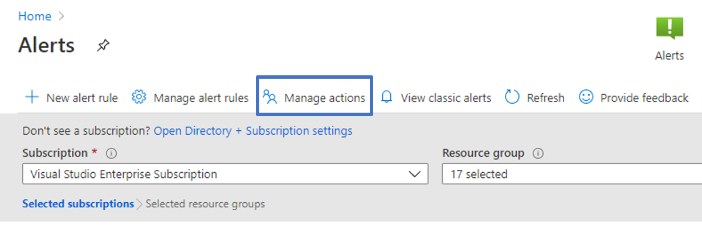
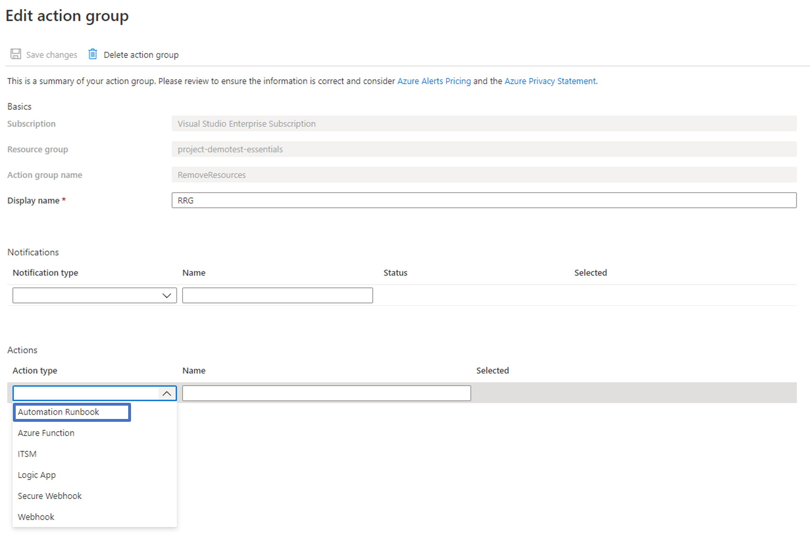
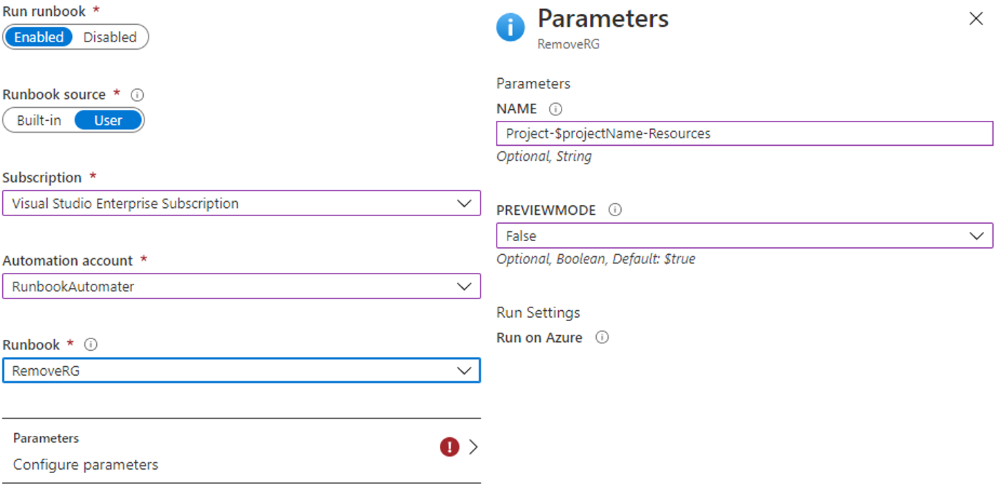
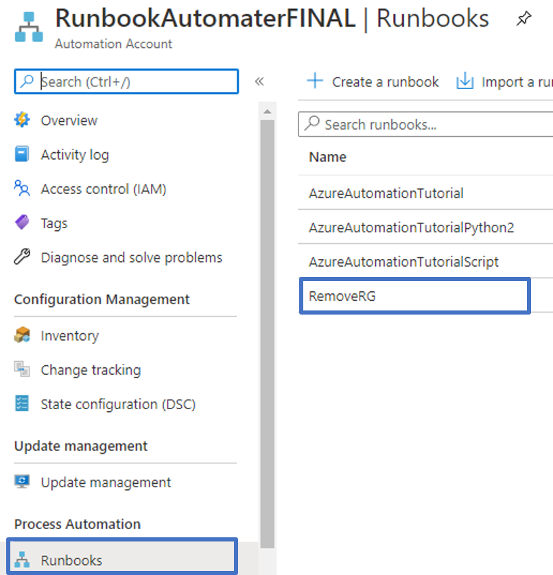

# Budget Control within Azure
Controlling costs within Azure can sometimes seem confusing which might lead to misunderstandings. This project aims to give a basic overview of the cost and budget structure within Azure as well as giving tools to control costs in an exact manner through alerts and ultimately shut down of resources.

## Table of contents
- [Budget Control](#budget-control)
  - [Budgets](#budgets)
  - [Action Groups](#action-groups)
    - [Runbooks](#runbooks)
  - [Recommended Control Structure](#recommended-control-structure)
  - [Alert Flow](#recommended-control-structure)
- [This Project](#this-project)
  - [Installation](#blueprint)
  - [Assign Blueprint](#assign-blueprint)
  - [Manual Configuration](#manual-configuration)
- [Troubleshooting](#troubleshooting)
- [Read More](#read-more)
- [Legal Notices](#legal-notices)


## Budget Control
Sometimes a project will have a fixed spending limit and in order to use cloud computing, it will be important to comply with said spending limit. In order to facilitate that several components within Azure can be utilized for free:
* Budgets allow the user to configure several events that occur at certain limits. A typical event is sending a mail to notify a certain limit has been crossed. An event can however also trigger action groups that allow even more advanced actions to trigger.
* Action groups allow for specific predetermined actions to be triggered when they are called from a budget. A useful action group can for example remove a resource group in order to immediately stop spending. This ensures compliance with a spending limit. Another use can be to send an SMS or turn off services within Azure.

These components are part of the Cost Management and Billing module within Azure, you can read more in the official [documentation](https://docs.microsoft.com/en-us/azure/cost-management-billing/costs/).
### Budgets
Budgets within Azure are connected to a scope and provide an overview of expenses in that scope. A scope in Azure is a grouping of resources, in short, there are three different levels here listed according to hierarchy: *Management Group*, *Subscription*, and *Resource Group*. For more information on scopes view the official [documentation](https://docs.microsoft.com/en-us/azure/cost-management-billing/costs/understand-work-scopes). A budget allows granular control of expenses of spending within these scopes for hands-on experience please check out the following official [tutorial](https://docs.microsoft.com/en-us/azure/cost-management-billing/costs/tutorial-acm-create-budgets).

### Action Groups
Action groups are collections of actions that can be triggered through the group. There is a variety of different actions that can be triggered from notifications to PowerShell scripts. Specifically triggering scripts, called runbooks, is of great interest since these allow for a high degree of control, from removing resources, making new deployments, or automizing tasks.

In order to view and create action groups navigate to **Alerts -> Manage actions**. Also for more information refer to the following [guide](https://docs.microsoft.com/en-us/azure/azure-monitor/platform/action-groups).

#### Runbooks
Runbooks are scripts which are kept within Azure that through an [Automation Account](https://docs.microsoft.com/en-us/azure/automation/automation-quickstart-create-account) can be run in Azure. These scripts can perform a variety of actions. The scripts can be written in several different programming languages for the full capabilities refer to the [documentation](https://docs.microsoft.com/en-us/azure/automation/automation-runbook-types). A useful runbook for controlling costs is one that can remove a specific resource group by matching its name exactly, this runbook is included in this project in the form of [RemoveRG.ps1](./RemoveRG.ps1).

### Recommended Control Structure
This is a recommendation of how to combine the technologies within Azure to create a good basis for cost control. **Note** this is only a recommendation and you might find several ways to improve it for your project.



The above control structure is the one that is provided by the blueprint in this project. Generally when the blueprint is assigned two resource groups will be created. One which is controlled by a budget, *Project-Resources*, and one, *Project-Essentials*, which contain the different services used to shut down the other resource group.

**Note** you can consider placing storage in the *Project-Essentials* resource group so when the spending limit is reached the storage/data is not deleted.

### Alert Flow
This section will introduce how different resources are combined in order to stop spending.

1. When the spending limit specified in the budget is reached an alert is triggered.
2. This alert triggers an action group which causes the RunAs Account to run a specific runbook.
3. The runbook, in this case, "RemoveRG" is started:
  4. The runbook finds the resource group matching the name given, $Name
  5. The runbook deletes the resource group that is found, which destroys all related resources

**Notice** the budget is checked every 12-14 hours, this means that alerts will only be triggered every 12-14 hours. You should therefore be aware that the deletion of the Resource Group might not happen immediately after the alert condition is achieved.



## This project
This project aims to automatize as much of the budget creation process as possible. There are several steps that must still be done manually but using this template will create budgets with the advised budget structure and allows for quick reconfiguration. In order to do this automatically [blueprints](https://docs.microsoft.com/en-us/azure/governance/blueprints/overview) are used, a blueprint is a template which can be deployed within Azure, when filled in it will automatically create the resources required. By assigning the blueprint created through the following section the recommended control structure will be deployed to subscription. This means the following resources are created:
* **Resource Group**: Project-XX-Essentials
  * **Automation Account**: RunbookAutomater
  * **Runbook**: RemoveRG (removes Resource Group of a given name)
  * **Action Group**: RemoveResourceGs
* **Resource Group**: Project-XX-Resources
  * **Budget**: project-budget

**Note** most of the names can be changed but use the default values above. Furthermore, the region of the deployment can also be configured.


## Installation

In order to deploy this template to Azure, PowerShell can be used. Here the *Blueprint* module for PowerShell is utilized, it can be installed using the following command. **Note** admin privileges are required to install the package.

```powershell
Install-Module -Name Az.Blueprint
```

Having installed the module navigate to the root of this project so that the *blueprint.json* file is in the active folder. Here run the following PowerShell command. **Note** here you can use either a subscription ID or management group ID, also remember to login into Azure using the `Connect-AzAccount` command.

```powershell
$blueprintName='GenericBlueprintName'
Import-AzBlueprintWithArtifact -Name $blueprintName -InputPath  "." -SubscriptionId 16f82r4f-2fb2-48o0-5ef8-f344b04kcb3b
```

This command imports this project as a blueprint in Azure. In Azure navigate to *Blueprint*. Here you should now see a blueprint named "GenericBlueprintName" which is a draft like the following image.



In order to begin using this template it has to be published, simply click the blueprint and click **Publish blueprint**. Here give a version name for example *1.0*. This way versioning can be used on the blueprint.

When the blueprint has been published it can then be assigned using the **Assign blueprint** button. The assignment process is described in the following section.

## Assign Blueprint
When the blueprint has been imported to Azure by following the above instructions it can be assigned. Navigate to the blueprint module within Azure (simply search "Blueprint"). Here select the blueprint that you have published. In this menu select the **Assign blueprint** button. This will launch an assignment where you will be asked to fill in a variety of parameters. Each parameter has a "help" bubble you can use some important ones to note are however the following:
* **projectName**: Name of the project, the generated resource groups will then be named using the following pattern: *Project-$projectName-Resources* and *Project-$projectName-Essentials*.
* **Project-$projectName-Resources/Location**: Location of the resource group.
  * **Project-Budget/Amount**: This is the total amount of the budget, notice the currency will be the type that you use in Azure, ex. DKK or US. Note you can always change this value at a later point.
  * **Project-Budget/timeGrain**: This determines the resolution of the budget whether it is a monthly, quarterly or yearly budget.
  * **Project-Budget/startDate**: The start date must be the first of the month in YYYY-MM-DD format. Future start date should not be more than three months. Past start date should be selected within the timegrain period.
  * **Project-Budget/endDate**: The end date of the budget is formatted as YYYY-MM-DD. This will determine how long the budget is active.
  * **Project-Budget/contactEmails**: This is a list of emails that should be notified when an alert is triggered (a threshold is passed).
* **Project-$projectName-Essentials/Location**: Location of the resource group.
  * **RunbookAutomater/automationAccountLocation**: Location of the automation account.
  * **RunbookAutomater/automationAccountName**: The name of the automation account. **Note** this name must be unique amongst automation accounts in the same subscription else an error is thrown at assignment.

When all parameters are configured simply press assign. This will cause Azure to deploy the entire infrastructure. **Note** if you encounter a 401 error during deployment then try to redeploy.

### Manual Configuration
While most of the infrastructure can be deployed using the blueprint two components must be created manually in the portal:
* RunAs Account
* Configure action group with a webhook that runs the runbook

Notice you can test the runbook
#### Setting up Run As Account
In order to give the Automation Account the privilege to execute different runbooks automatically, we must first configure a Run As Account. This is done by configuring the Automation Account and going to **account settings -> Run as account**. Here setup a Azure Run As Account.

The image below illustrates the different buttons in the Azure portal.


#### Configure Action Group
In order to have the action group, we deployed using the blueprint run the runbook which removes the resource we have to configure it. First, start by finding the action group in **Alerts -> Manage actions** as depicted below.



In the manage action view find the action group you want to alter. In this case the group **RemoveResources** in the resource group Project-$Name-Resources. Next, configure this action group here add a **runbook** action to the **actions** tab as seen below.



When the runbook has been selected you will be prompted to select a runbook and configure its parameters. Notice you must use **Runbook source -> User** in order to choose the runbook we created in this blueprint. In the parameters remember to type the exact name of the resource group that should be removed, also remember to turn preview mode off (false).


#### [Optional] Testing the runbook
The runbook can be tested by navigating to the created Automation Account and finding the runbook tab. Here the different runbooks will be listed among these the RemoveRG runbook will occur. The runbook can then be tested by pressing start and supplying a name.



**Note** the runbook can be run in preview mode where it will output what resources would be deleted but not delete them. This is a good way to test that everything works as expected. Also remember to have the Automation Account configured with Run As.
## Troubleshooting
If you experience problems feel free to open an issue. The project is not monitored frequently and long waiting times might occur. You are also welcome to contribute with answers to another persons issue.

## Read More
Budgets in Azure: https://docs.microsoft.com/en-us/azure/cost-management-billing/costs/tutorial-acm-create-budgets

ARM template for budgets as used here: https://docs.microsoft.com/en-us/azure/cost-management-billing/costs/quick-create-budget-template?tabs=CLI

## Legal Notices

Microsoft and any contributors grant you a license to the Microsoft
documentation and other content in this repository under the [Creative
Commons Attribution 4.0 International Public
License](https://creativecommons.org/licenses/by/4.0/legalcode), see
the [LICENSE](LICENSE) file, and grant you a license to any code in
the repository under the [MIT
License](https://opensource.org/licenses/MIT).

Microsoft, Windows, Microsoft Azure and/or other Microsoft products
and services referenced in the documentation may be either trademarks
or registered trademarks of Microsoft in the United States and/or
other countries. The licenses for this project do not grant you rights
to use any Microsoft names, logos, or trademarks. Microsoft's general
trademark guidelines can be found at
http://go.microsoft.com/fwlink/?LinkID=254653.

Privacy information can be found at https://privacy.microsoft.com/en-us/

Microsoft and any contributors reserve all other rights, whether
under their respective copyrights, patents, or trademarks, whether by
implication, estoppel, or otherwise.

# Contributing

This project welcomes contributions and suggestions.  Most contributions require you to agree to a
Contributor License Agreement (CLA) declaring that you have the right to, and actually do, grant us
the rights to use your contribution. For details, visit https://cla.opensource.microsoft.com.

When you submit a pull request, a CLA bot will automatically determine whether you need to provide
a CLA and decorate the PR appropriately (e.g., status check, comment). Simply follow the instructions
provided by the bot. You will only need to do this once across all repos using our CLA.

This project has adopted the [Microsoft Open Source Code of Conduct](https://opensource.microsoft.com/codeofconduct/).
For more information see the [Code of Conduct FAQ](https://opensource.microsoft.com/codeofconduct/faq/) or
contact [opencode@microsoft.com](mailto:opencode@microsoft.com) with any additional questions or comments.
